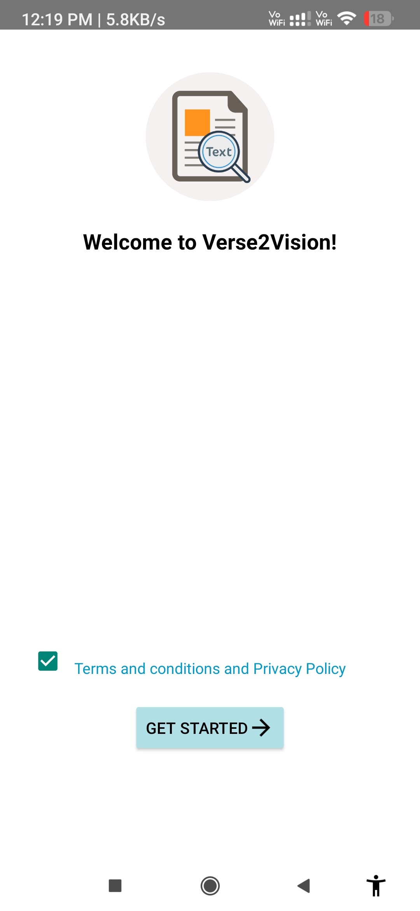
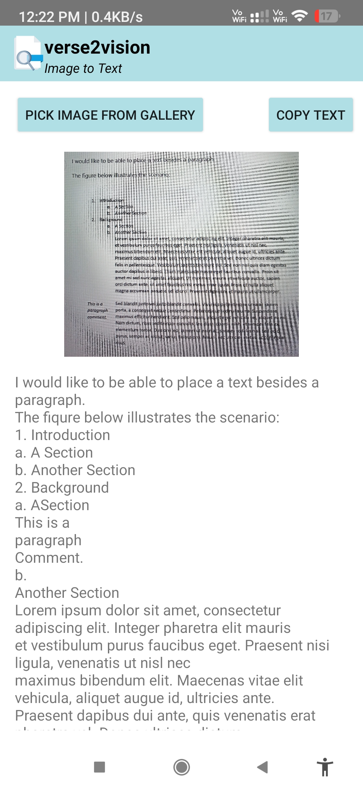

# Verse2Vision-TextExtractionApp
Text Extraction App is an Android app that lets users pick an image from the gallery and extract text using Google ML Kit’s OCR. Recognized text appears instantly and can be copied to the clipboard. Features a clean UI, offline processing, and state preservation on rotation.

✨ Features:

- Pick an image from the gallery

- Perform offline OCR using Google ML Kit

- Display recognized text instantly

- Copy extracted text to clipboard with one tap

- Saves state on screen rotation

- Modern, clean UI with edge-to-edge layout support

🛠 Tech Stack:

- Language: Kotlin

- Framework: Android SDK

- Text Recognition: Google ML Kit (TextRecognition API)

- UI: XML Layout + Material Design components

🚀 How It Works:

- Read The Terms And Conditions And Privacy Policy And Tick The Checkbox. (Note: If The Checkbox isnt tick You wont be able to continue)

- Press The GetStarted Button To Go To The Ocr Screen. 

- User selects an image from the gallery.

- The image is processed using ML Kit’s OCR.

- Extracted text is displayed on screen.

- User can copy the text to clipboard.

  
  

